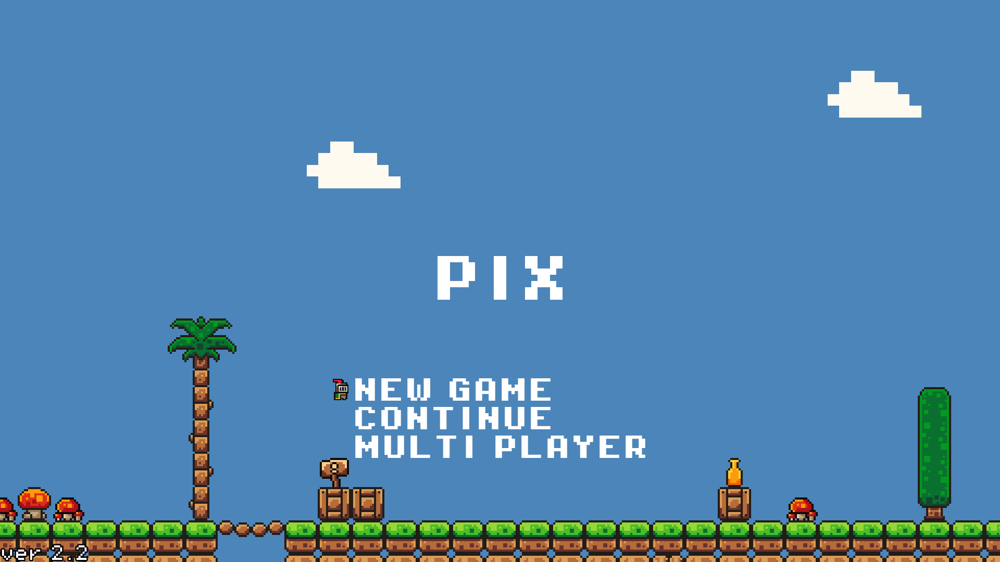

# Pixel Adventure

Godot Engine を用いて制作した、2D横スクロールアクションゲームです。

## スクリーンショット

## ダウンロード

https://github.com/makino-yuto/pixel-adventure/releases/tag/v2.2

## ゲーム概要

- 2D横スクロールアクション
- ジャンプ・移動などの基本操作

## 技術スタック

- Godot Engine
- GDScript
- Git / GitHub

## 起動方法

1. Releases から `.exe` ファイルをダウンロード
2. ダウンロードした `x.x.exe` を実行

追加のインストールは不要です。
